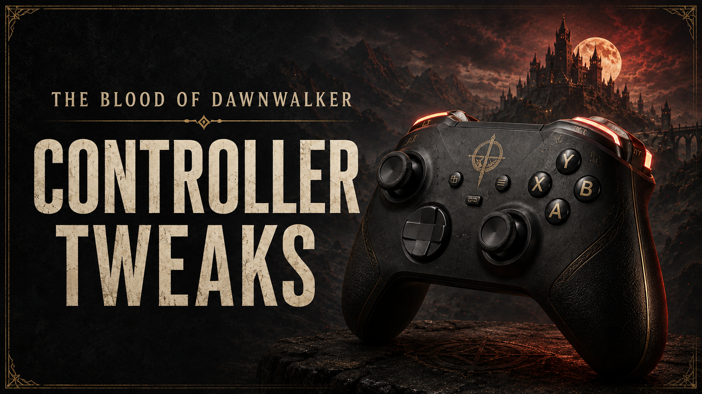

# Controller Tweaks and Remap



Controller improvements for *The Blood of Dawnwalker* on PC, with one personal INI for all 31 bindings in the Default and Alternative controller presets.

## Experimental input fixes

This branch provides **Controller-Tweaks-and-Remap-Experimental-Fixes.zip**, a complete alternative package based on 1.5.2.

- Controller overrides update every linked action in the active input profile, including Focus actions whose context contains an unresolved key. Keyboard bindings retain their separate profile slot.
- Focus controls take priority over ordinary interaction while Focus is active. This addresses shared Interact/Attack buttons such as X in Alternative without moving Interact globally.
- Attack and the controller ability wheel can use different buttons. Both follow their own INI setting.

See [Input bindings](INPUT-BINDINGS.md) for linked actions, input rules and configuration examples.

- **Configurable controls:** assign a physical controller button to each action in `ControllerTweaks.ini`. Changes load at game startup.
- **Linked Bite controls:** `Player_Drink_Blood` starts Voracious Bite in Focus and controls the hold while feeding. Necrospeak in Focus shares this button.
- **Alternative preset support:** retains the original Alternative layout, with Bite/feeding on LB/L1 instead of X/Square to avoid the Attack conflict.
- **Shoulder/trigger swap in the Default preset:** LB ↔ LT and RB ↔ RT (PlayStation L1 ↔ L2 and R1 ↔ R2), including Photo Mode.
- **Easier walking:** gives you a wider stick range for walking. Shapeshift and Mercurial Fervour stay active when you steer with the stick fully pushed.
- **Short press / long press:** by default, Back/View (PlayStation touchpad) opens the Map on a short press and the Game Hub on a long press (0.30 seconds).

With the Default layout, Block is LT, Focus Mode/Combat Abilities LB, Attack/Overworld Abilities RT, and Shadowstep RB. Alternative retains its face-button attack/block layout and uses LT/L2 for Focus; walking and Map/Game Hub improvements work with either preset.

## Requirements and installation

Requires **Dawnwalker UE4SS RC5 for build 25129649**, including its reflected struct ref/out support, TMap API and `ExecuteInGameThreadWithDelay`. Its reference base is **3.0.1 Beta, commit 97b7e501c**. The older UE4SS 3.0.0 stable release does not provide all required APIs. Install the appropriate loader through Vortex separately; it is not bundled. HUDTweaks is not required.

1. Download **Controller-Tweaks-and-Remap-Experimental-Fixes.zip**. Use this complete experimental package in place of the main package; do not enable both copies in Vortex.
2. Import it into Vortex 1.14 or newer as **Root (game folder)**, then enable and deploy.
3. Select **Default** or **Alternative** in the game's controller settings, then restart the game.

To update, use Vortex's replace/reinstall flow on the existing entry with the new ZIP and deploy. Keep one enabled Controller Tweaks and Remap entry. Personal settings under your Windows profile are outside the archive and survive replacement and uninstall. For the first upgrade from a package that stored your INI inside the mod folder, preserve that file before reinstalling; see the release notes for migration.

To uninstall, close the game, disable/remove the mod and deploy through Vortex. Restart to discard runtime changes. The personal INI remains for future installs; remove it yourself only if you want to reset your preferences.

## Configuration

Launch the game once with the mod, then close it. Open this directory using File Explorer's address bar:

`%LOCALAPPDATA%\Dawnwalker\Saved\Config`

Edit **ControllerTweaks.ini** there. The mod creates it only if missing, with the complete documented layout and every setting commented out. Uncomment only the settings you want to change, save and restart the game. Editing this personal file does not require Vortex deployment.

The archive includes **ControllerTweaks.defaults.ini**, which documents all 31 actions and all supported controls. It is the maintained default configuration; do not edit it for personal preferences. For Default, the mod loads the shipped INI layout. For Alternative, it starts from the original Alternative layout with Bite/feeding on LB/L1. Your active personal entries then override either preset. Omitted/commented values inherit the defaults for the selected preset. An older personal file with every binding active overrides the entire layout; comment out values you want to inherit. Existing personal files are never rewritten, even when empty, malformed or read-only.

Settings are read once per game session. After input setup completes, the remapper stops its worker; it does not continuously poll the INI or bindings. Loading, possession changes and input-context setup can trigger a bounded reapply using the same settings. An unavailable input system stops retrying after 20 attempts and waits for another input lifecycle event.

For example, these overrides restore the stock combat shoulder/trigger arrangement when using Default:

```ini
[Bindings]
Combat_Block = LB
Player_Focus_Mode = LT
Combat_Abilities = LT
Combat_Attack = RB
Player_Abilities_Gamepad = RB
Player_Shadowstep = RT
```

### Voracious Bite and the Alternative preset

Use **`Player_Drink_Blood`** for both starting Voracious Bite in Focus and holding to feed. Change this one setting; there is no separate Bite-start setting. **Necrospeak in Focus uses the same button.** Normal world interactions remain on `Player_Interact`, and Death from Above remains on `Combat_Attack`.

- **Default:** Bite/feeding uses X/Square unless you override it.
- **Alternative:** Bite/feeding uses LB/L1 unless you override it; Attack stays on X/Square. No INI edit is needed for a new or fully commented personal file.
- **Existing Alternative users:** if your personal INI explicitly sets `Player_Drink_Blood = X`, change that entry to `LB` or comment it out. Avoid duplicate entries. Other active personal overrides remain in effect.

Keep Bite different from Attack and Focus. The log reports a Bite/Attack collision with the setting names to change. LB also remains the Alternative combat quickslot-toggle button in its own context. Settings load at startup; save and restart after editing.

The linked Focus action is shared by input devices: **keyboard Focus Bite and Necrospeak now use the game's Drink Blood key as well**. Controller INI values do not change keyboard bindings.

Existing personal INIs retain their comments and values. The updated binding explanation is in the packaged `ControllerTweaks.defaults.ini`; an existing personal file is not replaced just to refresh its reference comments.

The shipped defaults file documents all 31 actions, grouped by gameplay context, plus every supported key alias and full Unreal key name. Comments explain stick clicks versus stick axes, shared buttons and the fixed short-press/long-press behavior. Values are case-insensitive:

| INI value | Physical control / PlayStation equivalent |
| --- | --- |
| A, B, X, Y | Cross, Circle, Square, Triangle |
| LB, LT, RB, RT | L1, L2, R1, R2 |
| LS, RS | Stick clicks / L3, R3 |
| View, Menu | Back/View or touchpad; Start/Menu or Options |
| DPadUp, DPadDown, DPadLeft, DPadRight | D-pad directions |
| LeftStick, RightStick | Two-dimensional stick axes; movement/camera only |
| RightStickLeft, RightStickRight | Right-stick directions used for target switching |

The equivalent full `Gamepad_*` names are also accepted. Each entry names the physical control to press, not another action. Assign both `Player_Hub_Map` and `Player_Hub_Launch` to the same button to retain their shared short-press/long-press shortcut. Their 0.30-second timing and the 0.90 walking threshold remain fixed.

Several actions intentionally share buttons in different contexts. Focus Mode and Combat Abilities may share a button, but they do not have to match. Attack and Overworld Abilities are independent; Alternative already uses different buttons. Keep the two hub shortcuts together for short-press/long-press behavior. Focus receives priority over ordinary interaction, but arbitrary simultaneous actions can still block each other or both activate. The mod does not invent new chords. Menu confirm/cancel navigation outside the preset is not configurable here. Movement/camera require stick axes, and button actions cannot use those axes.

Missing personal entries inherit the defaults for the selected preset. Unknown settings, unknown controls, duplicate entries and incompatible axis assignments reject the whole file and leave the packaged layout in effect. `[General] Enabled = false` disables only INI remapping; the packaged shoulder/trigger swap, linked Focus Bite/Necrospeak input, walking and hub changes remain. Alternative INI support and its LB Bite default require remapping enabled; a disabled/invalid INI can therefore leave the original Alternative X conflict. `debugLogging = true` reports updates in `ue4ss/UE4SS.log`. Search the log for `[ControllerTweaks]` if controls do not change.

## Compatibility

Other mods that change walking or controller controls may conflict.

Earlier standalone shoulder/trigger and TapMapHoldMenu/controller compatibility mods are superseded; disable them through Vortex. This mod has its own UE4SS directory and no HUDTweaks overrides. All three `zzz_DawnwalkerControllerTweaks_P` container files must come from the same release.

Based on Steam build **25129649 / CL-257186**. The game's cached button prompts or controller-layout screen may show the original preset even when a runtime binding changes. Actual actions follow your chosen bindings.

Original mod work is licensed under [MIT](LICENSE.txt). Game assets belong to their respective rightsholders and are not relicensed.
