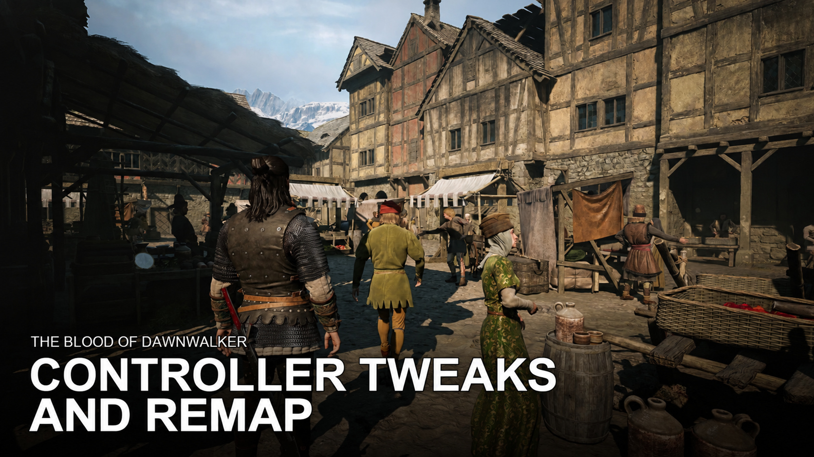

# Controller Tweaks and Remap

Controller improvements for *The Blood of Dawnwalker* on PC, with one personal INI for all 31 bindings in the Default and Alternative controller presets.

## Experimental input fixes

This branch provides **Controller-Tweaks-and-Remap.zip**, a complete alternative package based on 1.5.2.

- Controller overrides update every linked action in the active input profile, including Focus actions whose context contains an unresolved key. Keyboard bindings retain their separate profile slot.
- Focus controls take priority over ordinary interaction while Focus is active. This addresses shared Interact/Attack buttons such as X in Alternative without moving Interact globally.
- Attack and the controller ability wheel can use different buttons. Both follow their own INI setting.

See [Input bindings](INPUT-BINDINGS.md) for linked actions, input rules and configuration examples.

- **Configurable controls:** assign a physical controller button to each action in `ControllerTweaks.ini`. Changes load at game startup.
- **Linked Bite controls:** `Player_Drink_Blood` starts Voracious Bite in Focus and controls the hold while feeding. Necrospeak in Focus shares this button.
- **Alternative preset support:** retains the original Alternative layout, with Bite/feeding on LB/L1 instead of X/Square to avoid the Attack conflict.
- **Shoulder/trigger swap in the Default preset:** LB ↔ LT and RB ↔ RT (PlayStation L1 ↔ L2 and R1 ↔ R2), including Photo Mode.
- **Easier walking:** gives you a wider stick range for walking. Shapeshift and Mercurial Fervour stay active when you steer with the stick fully pushed.
- **Short press / long press:** by default, Back/View (PlayStation touchpad) opens the Map on a short press and the Game Hub on a long press (0.30 seconds).

With the Default layout, Block is LT, Focus Mode/Combat Abilities LB, Attack/Overworld Abilities RT, and Shadowstep RB. Alternative retains its face-button attack/block layout and uses LT/L2 for Focus; walking and Map/Game Hub improvements work with either preset.

## Requirements and installation

Requires **Dawnwalker UE4SS RC5 for build 25129649**, including its reflected struct ref/out support, TMap API and `ExecuteInGameThreadWithDelay`. Its reference base is **3.0.1 Beta, commit 97b7e501c**. The older UE4SS 3.0.0 stable release does not provide all required APIs. Install the appropriate loader through Vortex separately; it is not bundled. HUDTweaks is not required.

1. Download **Controller-Tweaks-and-Remap.zip**. Use this complete experimental package in place of the main package; do not enable both copies in Vortex.
2. Import it into Vortex 1.14 or newer as **Root (game folder)**, then enable and deploy.
3. Select **Default** or **Alternative** in the game's controller settings, then restart the game.

To update, use Vortex's replace/reinstall flow on the existing entry with the new ZIP and deploy. Keep one enabled Controller Tweaks and Remap entry. Legacy personal settings under your Windows profile are imported once. Back up the generated settings.ini before uninstalling/reinstalling; see SETTINGS.md for migration and restoration.

To uninstall, close the game, disable/remove the mod and deploy through Vortex. Restart to discard runtime changes. Back up settings.ini before removal and restore it before the next launch if reinstalling.

## Settings

Use [Mod Setting Menu 1.0.5 or later](https://www.nexusmods.com/thebloodofdawnwalker/mods/271) from the main menu. Press Apply, then fully restart the game. See [SETTINGS.md](SETTINGS.md) for all controls, first-use import and preference backups. Console settings commands are retired.

## Compatibility

Other mods that change walking or controller controls may conflict.

Earlier standalone shoulder/trigger and TapMapHoldMenu/controller compatibility mods are superseded; disable them through Vortex. This mod has its own UE4SS directory and no HUDTweaks overrides. All three `zzz_DawnwalkerControllerTweaks_P` container files must come from the same release.

Based on Steam build **25129649 / CL-257186**. The game's cached button prompts or controller-layout screen may show the original preset even when a runtime binding changes. Actual actions follow your chosen bindings.

Original mod work is licensed under [MIT](LICENSE.txt). Game assets belong to their respective rightsholders and are not relicensed.

Bundled library

This mod includes the MIT-licensed ue4ss-common Lua helpers (https://github.com/my-mods/ue4ss-common). No separate library installation is required. Its license is included in LICENSES/DawnwalkerControllerTweaks-ue4ss-common.txt.
